## PowerShell命令

### 1.get-help,首先需要以管理员身份端口powershell然后链接网络更新get-help

```powershell
get-help get-eventlog
```

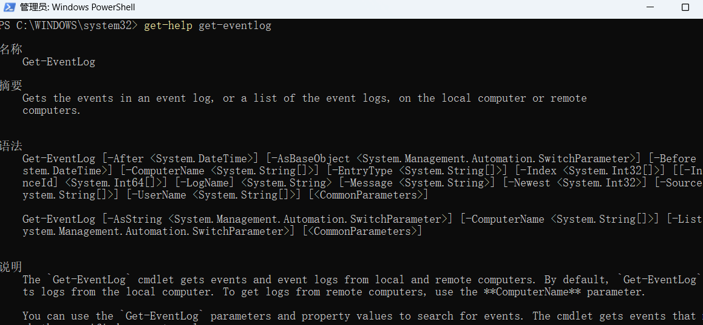

### 2.get-eventlog

```powershell
get-eventlog -list
```

效果:

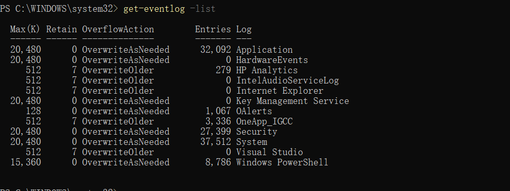

```powershell
get-eventlog -logname system -newest 5
```

效果:

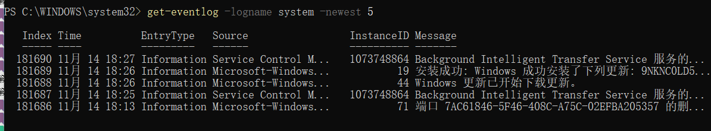

```powershell
$event = get-eventlog system -newest 50
$event | group-object -property source -noelement | sort-object -property count -descending
```

效果:

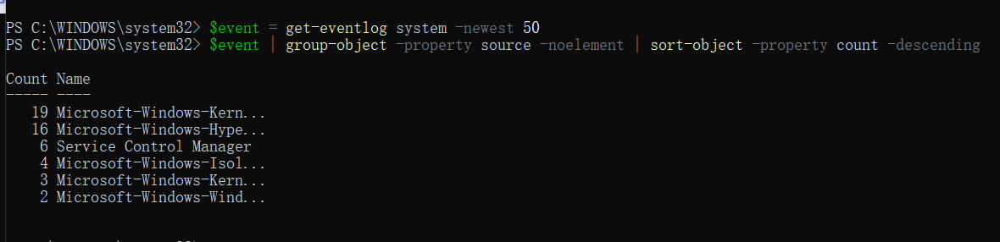

```powershell
get-eventlog -logname system -entrytype error -newest 10
```

效果:

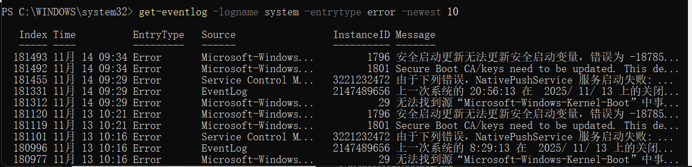

```powershell
 get-eventlog -logname system -instanceid 10016 -source DCOM -newest 10
```

效果:

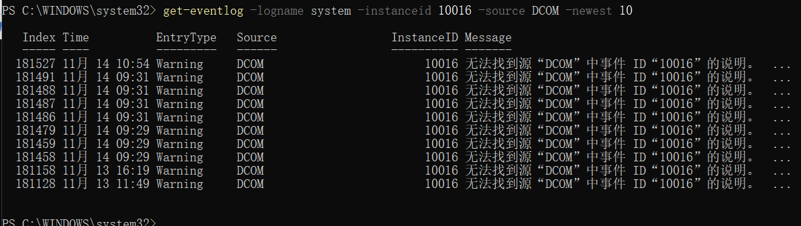

```powershell
 get-eventlog -logname system -computername KENNYCAI -newest 10
```

效果:

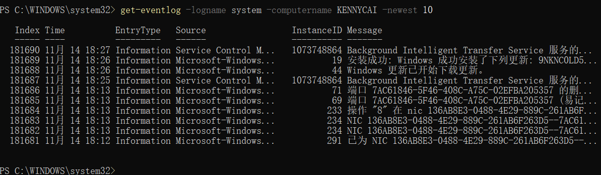

```powershell
get-eventlog -logname system -newest 1 | select-object -property *
```

效果:

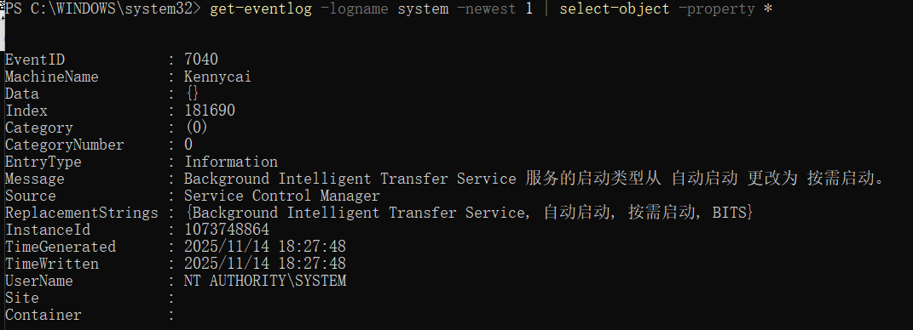

```powershell
Get-EventLog -LogName System -UserName NT* -newest 10
```

效果:

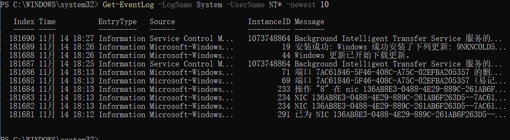

### 3.get-childitem

```powershell
get-childitem c:\windows
```

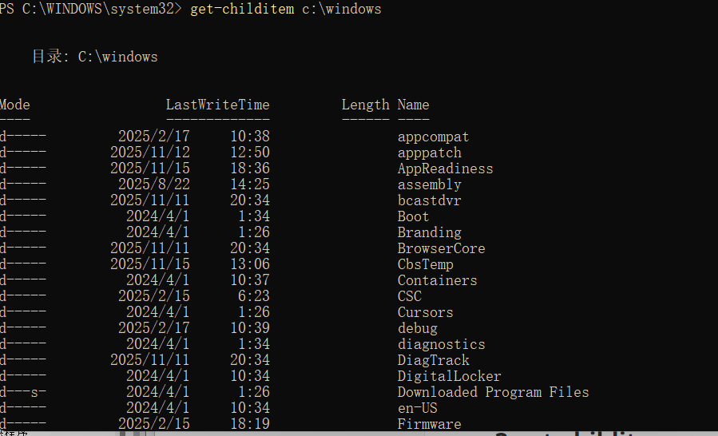

```powershell
get-childitem c:\users
```

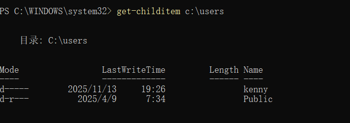

### 4.show-command

```powershell
show-command get-eventlog
```

效果,会弹出一个对话框,你可以在这里填写参数

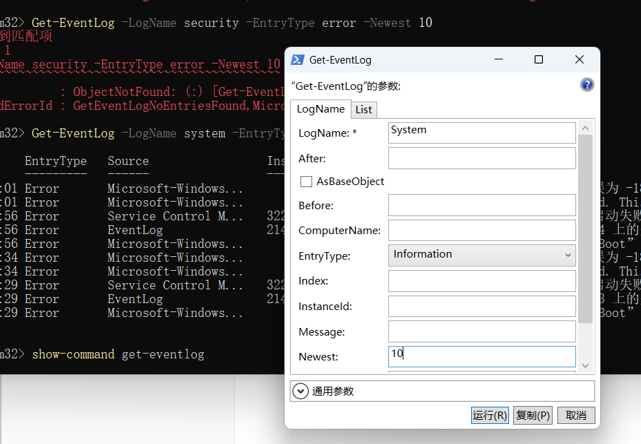

点击运行,就会生成对应的命令

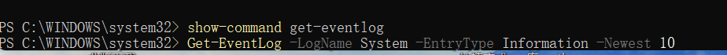

直接按回,就会有命令输出

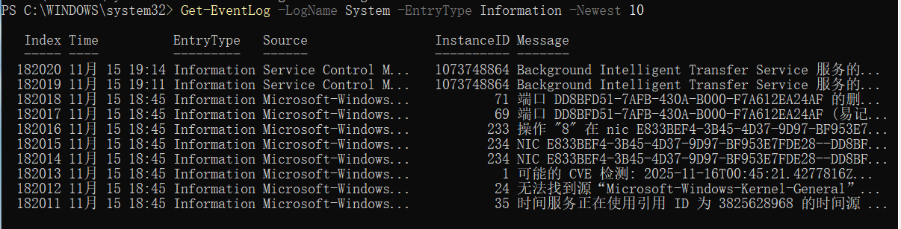

#### 练习1(powershell实战指南第四章)

###### 1>获取真正运行的进程列表

 `get-process`

还可以这么用

```powershell
Get-Process | ForEach-Object {
    $processName = $_.ProcessName
    $processId = $_.Id
    $threadIds = ($_.Threads | ForEach-Object { $_.Id }) -join ', '
    "$processName`t$processId`t$threadIds"
} | Out-File "d:\process_output.txt" -Force -Encoding UTF8
```

会在d盘生成一个process_output.txt文件

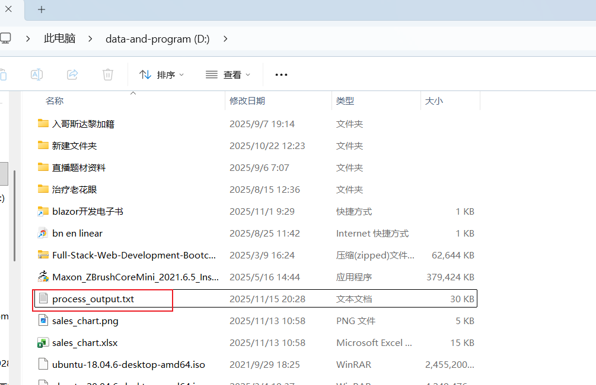


###### 2>显示最新的100个应用程序日志

```powershell
Get-EventLog -LogName Application -Newest 100
```

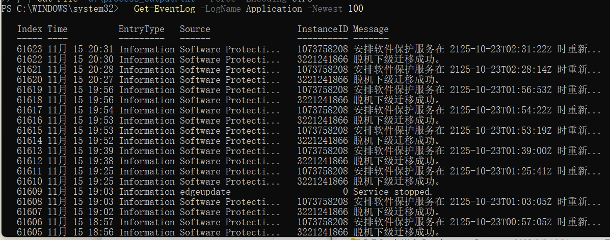

###### 3显示所有类型为cmdlet的命令

```powershell
Get-Command -CommandType Cmdlet
```

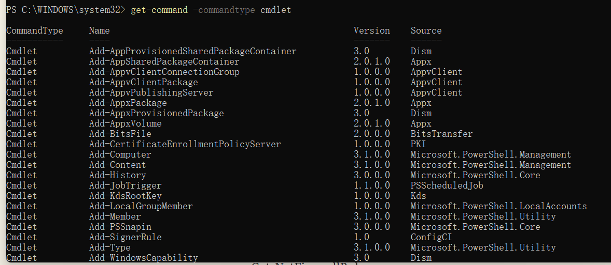

###### 4显示所有的命令别名

```powershell
get-alias
```

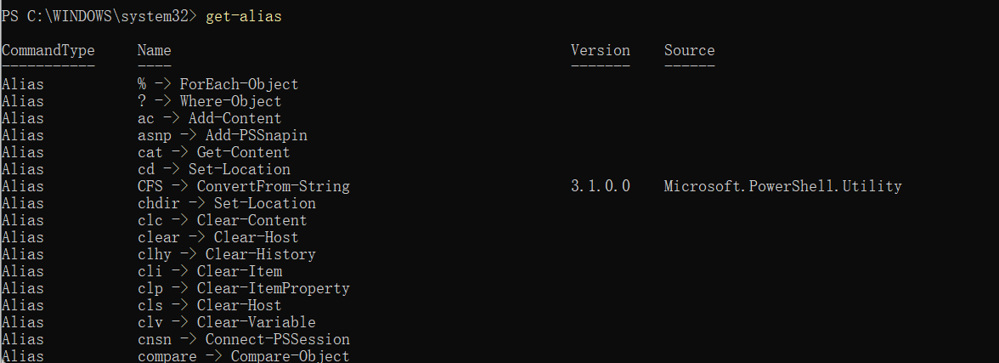

###### 5.创建一个新的别名，使用该别名，你可以运行"np" 来打开notepad

```powershell
 new-alias np notepad.exe
```

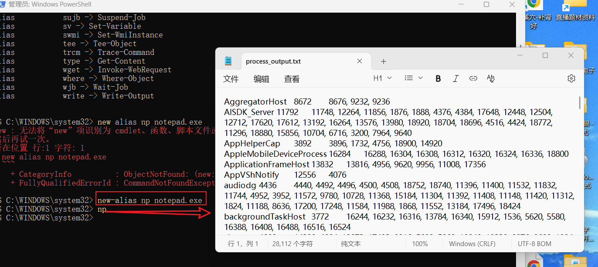

###### 6.显示以字母M开头的服务名称

```powershell
Get-service -name "M*"
```

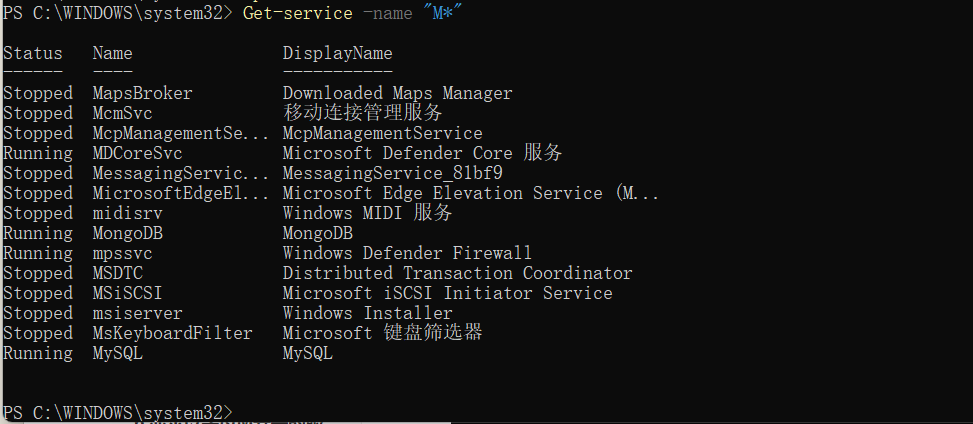

###### 7.显示所有的Windows 防火墙规则

```powershell
Get-NetFirewallRule
```

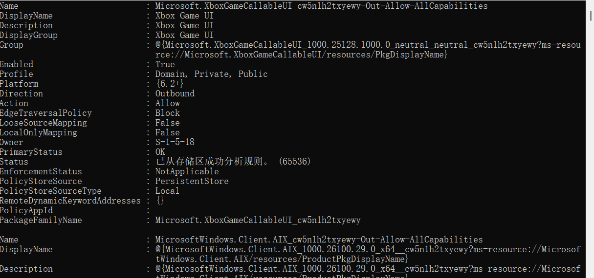

如果显示所有有点长,可以使用select-object来筛选数据.比如只显示前3条

```powershell
 Get-NetFirewallRule | Select-Object -First 3
```


可以把这个命令的输出保存到一个文件中

~~~powershell
Get-NetFirewallRule | out-file "d:\firewall-rules.txt"
~~~

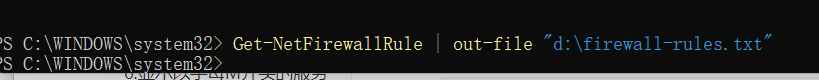


###### 8.显示所有Windows 防火墙的入站规则,因为规则很多,我们只选择前3条,和select-object配合使用

```powershell
Get-NetFirewallRule -direction inbound | select-object -first 3
```


当然也可以有出站规则

```powershell
 Get-NetFirewallRule -direction outbound | select-object -first 3
```

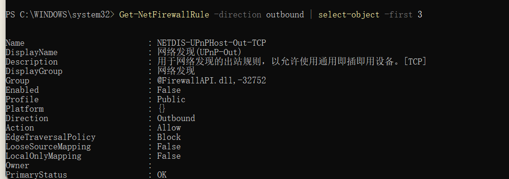

## powershell 提供程序(PSProvider)

### 1.可以使用下面的命令来查看使用的PSProvider

```powershell
get-PSProvider
```

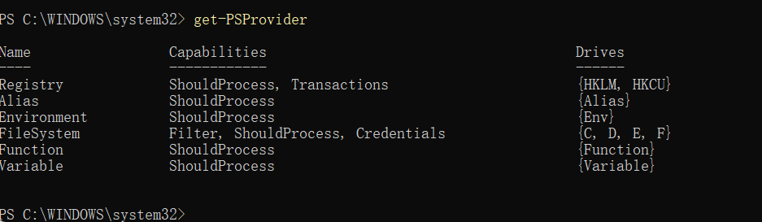

### 2.在powershell中有一个PSDrive的东西,就相当于cmd里面的驱动器映射,可以用下面的命令来查看

```powershell
get-PSDrive
```

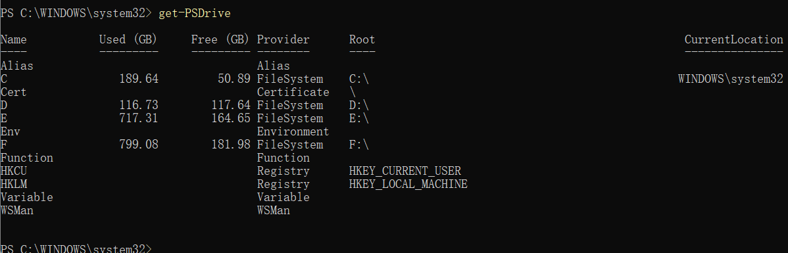

#### 练习2(powershell实战指南第五章)

##### 1>在注册表中，定位到 HEKY_CURRENT_USER\software\microsoft\Windows\currentversion\explorer。选中“Advanced”项，然后修改DontPrettyPath的值为0

```powershell
set-location HKCU:\software\microsoft\windows\currentversion\explorer
set-itemproperty .\Advanced\ -psproperty DontPrettyPath 0
```

##### 2>创建一个名为C:\Labs的文件夹

```powershell
set-location c:\
new-item -name labs -itemtype directory
```

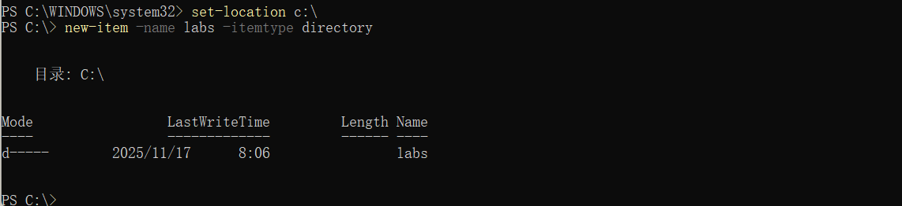

##### 3>创建一个长度为0的文件，命名为C:\Labs\Test.txt

```powershell
 new-item -path .\labs -name test.txt
```

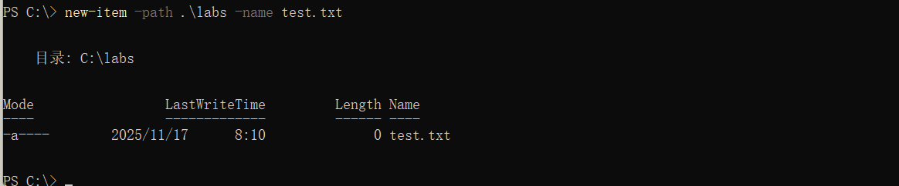

##### 4>尝试使用Set-Item去修改C:\Labs\Test.txt的内容为 Testing，是否可行？或者是否有报错？如果有报错，也请想一下为什么会报错？

```
肯定错，这是它内容，内容不属于item
```

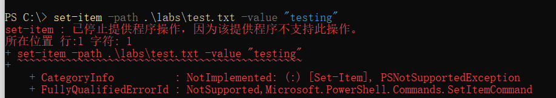

###### 设置内容需要使用set-content

```powershell
set-content -path  .\labs\test.txt -value "testing"
```

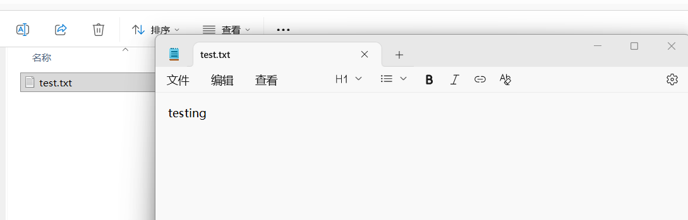

##### 5>使用环境提供程序，显示操作系统变量%Temp%

```powershell
set-location -path Env:
get-item Temp
```

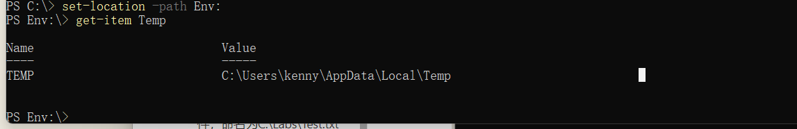

还有简单的写法

```powershell
get-item env:temp or dir env:temp
```


##### 6>Get-ChildItem的-Filter、-Include、-Exclude参数之间有什么不同

```
字面意思的不同
```

## 管道命令,就是用|把两个cmdlet连接起来,前面的输出就是后面的输入

#### 把get-process命令的结果输出到一个csv文件中

```powershell
get-process | export-csv d:\process.csv
```

#### 可以获取所有的cmdlet,然后保存到一个csv文件中

```powershell
PS D:\>get-command | export-csv cmdlet.csv
```

查看我们生成的csv文件

```powershell
import-csv cmdlet.csv
```

#### 把命令结果输出到一个xml文件中

```powershell
get-process | export-clixml proc.xml
```

查看xml文件

```powershell
import-clixml proc.xml
```

把get-command的结果保存到xml中

```powershell
get-command | export-clixml cmdlet.xml
```

#### 我们可以使用out-file把一个命令的结构输出到一个文件,out-host输出到控制台,out-printer可以打印但是如果没有打印机,会输出到一个虚拟打印机如输出到pdf文件,比如

```powershell
PS D:\> dir | out-printer
```

我没有安装打印机,输出到一个pdf文件

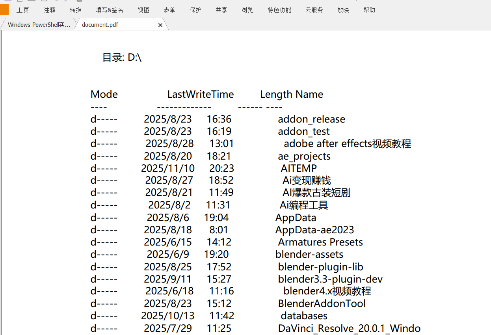

#### 如果你的电脑安装了powershell ise还可以使用下面的命令

```powershell
PS D:\> dir | out-gridview
```

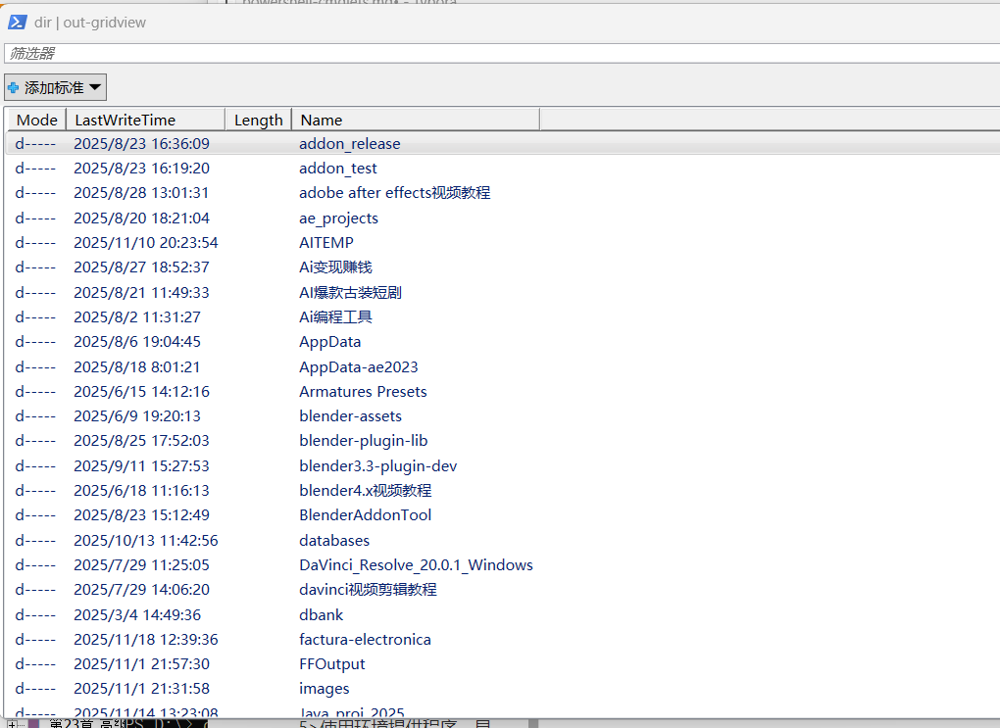

#### 把一个命令的结果输出到一个html文件中

```powershell
get-service | convertTo-html | out-file services.html
```

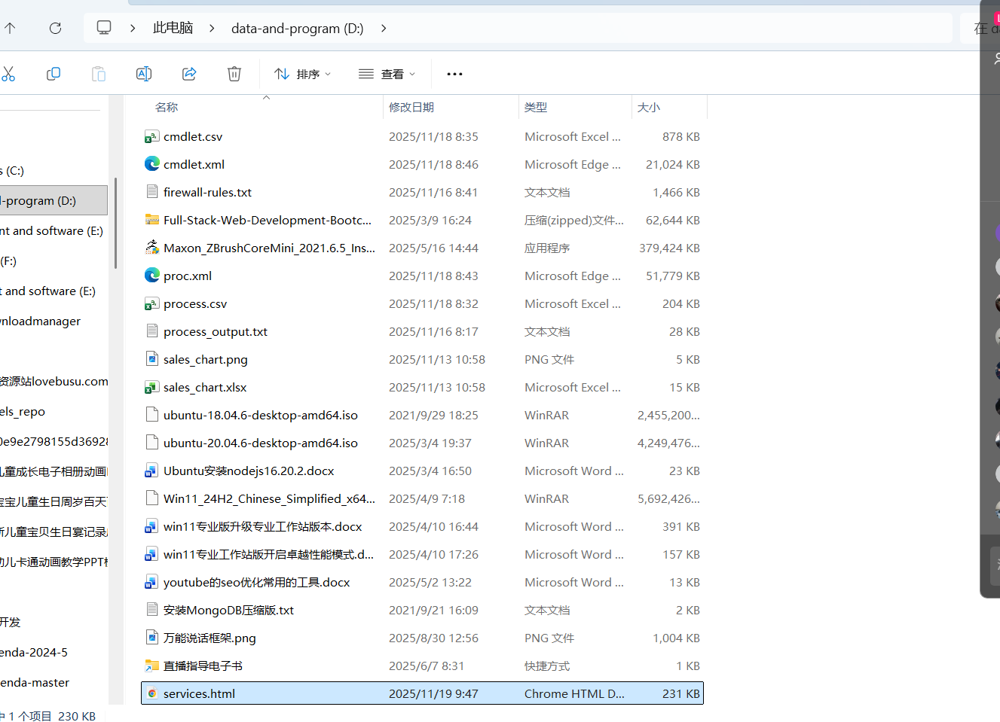

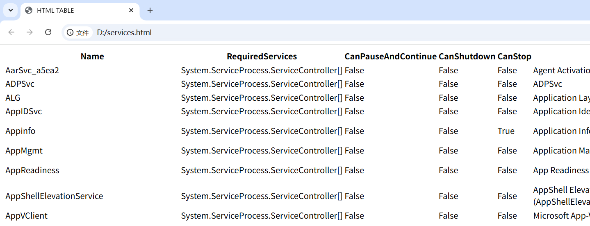

##### 注意: powershell中有很多convertTo-xxx的命令他们是输出到控制台的,需要和out-file组合使用才能够输出到文件.如convertTo-html,convertTo-xml,convertTo-csv等等

### 有些命令最好不要连用,否则效果不堪设想,如get-process是获取所有真正运行的的进程,stop-process是停止所有真正运行的进程,如果你把get-process和stop-process一起使用,就会把所有的进程都停止了,这个是非常不好,试想一下,如果一台电脑的所有进程都停止了,会发生什么现象啊,非常危险!!

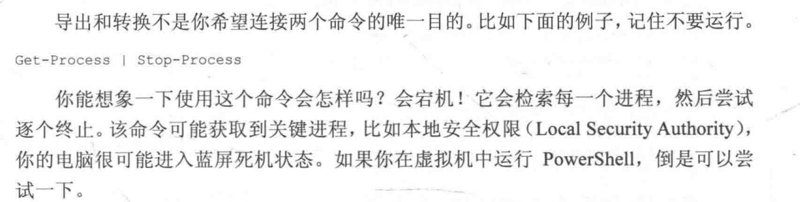

##### 但是你可以用get-process -name xxx |stop-process,这是可以的,因为你只是找到一个特定的进程然后把它终结.这个没有问题,注意,注意,不能够把所有的进程都终结.!!

#### 类似的,get-service命令也不要和stop-service命令连接使用,非常往下.

#### 还有就是一些根本就不相干的命令也不要用|连接

### 查看shell的$ConfirmPreference设置

```powershell
$ConfirmPreference
```

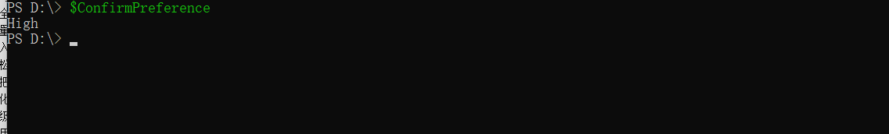

### 练习3(第六章)

1.创建两个类似的文件,然后用diff来比较他们的内容

file1.txt

```txt
Hello,world of PowerShwll
```

file2.txt

```txt
Hello,welcome,world of Powershell
```

```
PS D:\> echo Hello,world of PowerShwll > file1.txt
PS D:\> echo Hello,welcome,world of PowerShwll > file2.txt
PS D:\> $f1=get-content file1.txt
PS D:\> $f2=get-content file2.txt
PS D:\> diff $f1 $f2
```

效果

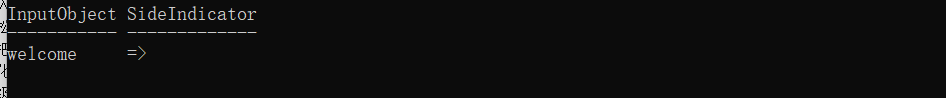

2.用管道把export-csv和out-file连接起来会有什么后果

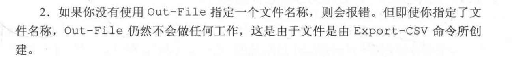

3.不使用get-service,单独使用stop-service来停止一个服务

```powershell
stop-service 服务名称
```

4.把一个命令的输出导出为csv文件,并且把分隔符官网|

```powershell
get-process | export-csv proc.csv -delimiter "|"
```

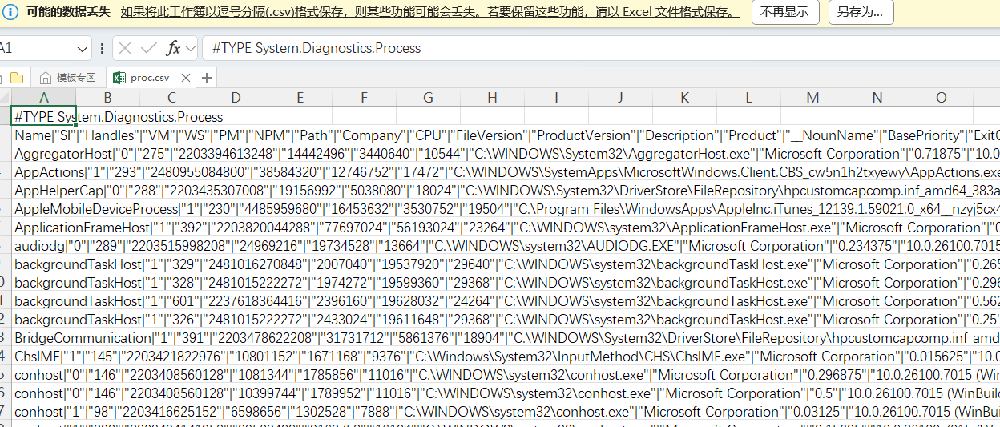

5.如何去除csv文件的#命令行

```powershell
get-process | export-csv proc.csv -NoTypeInformation
```

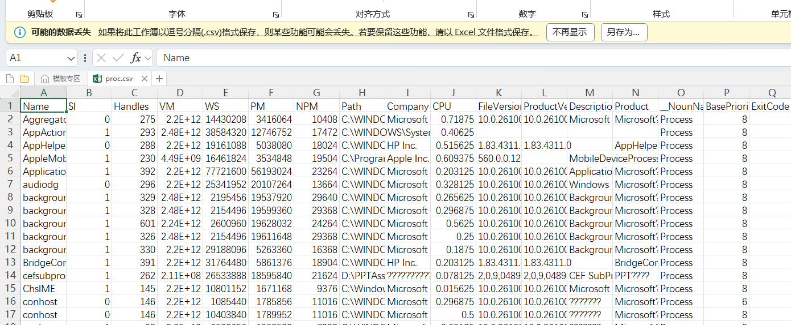

6.1设置export-csv命令不要覆盖现有文件(也不要头部信息)

```powershell
get-service|export-csv ser.csv -noclobber -notypeinformation
```

6.2设置export-csv命令添加确认功能(也不要头部信息)

```powershell
get-service|export-csv ser.csv -notypeinformation -confirm
```

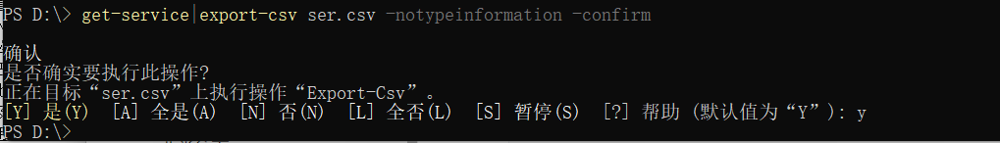

7.设置export-csv使用系统默认分隔符而不是逗号(也不要头部信息)

```pow
get-service|export-csv ser.csv -notypeinformation -useCulture
```

## powershell扩展命令

获取已经注册的pssnapin

```powershell
get-pssnapin -registered
```

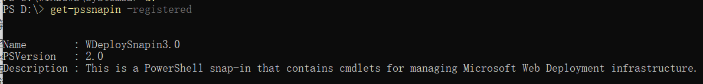

获取ps模块的存放地址

```powershell
get-content env:psmodulepath
```

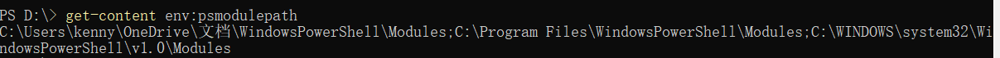

获取所有网络相关的命令

```powershell
 help *network*
```

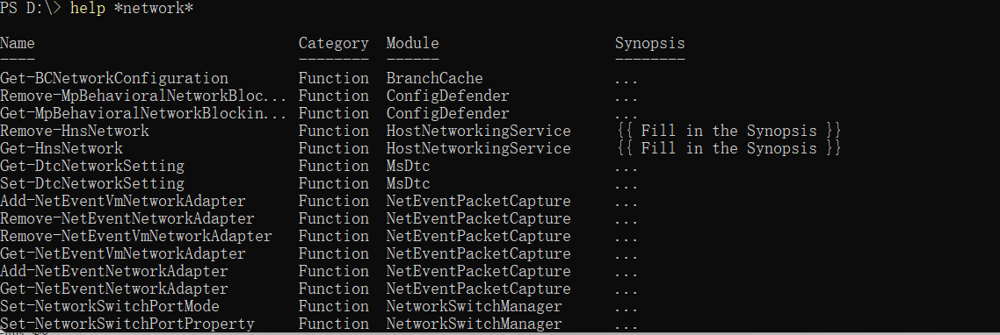

查看所有包涵dns的命令

```powershell
help *dns*
```

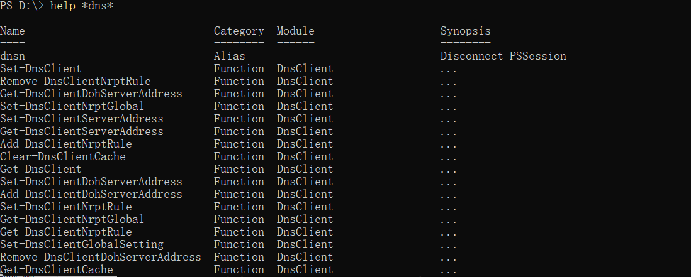

```powershell
import-module -name DnsClient
get-command -module DnsClient
```

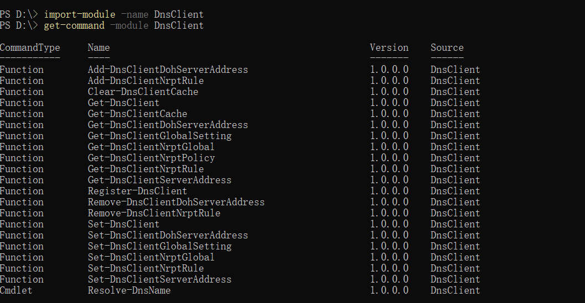

清理dns客户缓存的命令

```powershell
clear-dnsclientcache -verbose
```

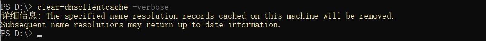

允许powershell执行脚本,需要下面的命令

```powershell
set-executionpolicy remotesigned
```

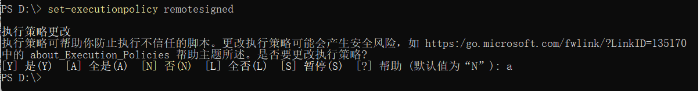

### 使用powershellget模块,需要安装

默认有一个源,又微软维护: https://www.powershellgallery.com/

# 如何安装 PowerShellGet 和 PSResourceGet


## 先决条件

确保安装了高于 1.0.0.1 的 **PowerShellGet** 和 **PackageManagement** 版本。 最新的稳定版本是 2.2.5 for **PowerShellGet** 和 1.4.8.1 for **PackageManagement**。

如果运行 Windows PowerShell 5.1 和 **PowerShellGet** 1.0.0.1，请参阅[更新 PowerShellGet for Windows PowerShell 5.1](https://learn.microsoft.com/zh-cn/powershell/gallery/powershellget/update-powershell-51?view=powershellget-3.x)。

若要访问 PowerShell 库，必须使用传输层安全性 (TLS) 1.2 或更高版本。 使用以下命令在 PowerShell 会话中启用 TLS 1.2。

PowerShell

```powershell
[Net.ServicePointManager]::SecurityProtocol =
    [Net.ServicePointManager]::SecurityProtocol -bor
    [Net.SecurityProtocolType]::Tls12
```

将此命令添加到 PowerShell 配置文件脚本，以确保为每个 PowerShell 会话配置 TLS 1.2。 有关配置文件的详细信息，请参阅 [about_Profiles](https://learn.microsoft.com/zh-cn/powershell/module/microsoft.powershell.core/about/about_profiles)。

如果运行的是 PowerShell 6.0 或更高版本，则已安装较新版本的 **PowerShellGet** 和 **PackageManagement** 。 如有必要，可以升级到较新版本，也可以安装预览版。 应始终安装最新的稳定版本。

使用以下命令查看已安装的版本。

PowerShell

```powershell
Get-Module PowerShellGet, PackageManagement -ListAvailable
```

以下输出显示需要安装最新的稳定版本。

Output

```Output
    Directory: C:\Program Files\WindowsPowerShell\Modules


ModuleType Version  Name               ExportedCommands
---------- -------  ----               ----------------
Binary     1.0.0.1  PackageManagement  {Find-Package, Get-Package, ...
Script     1.0.0.1  PowerShellGet      {Install-Module, Find-Module, ...
```


## 安装最新的稳定版本

若要安装这些模块的最新版本，请运行以下命令：

PowerShell

```powershell
Install-Module PowerShellGet -Force -AllowClobber
```


## 安装 Microsoft.PowerShell.PSResourceGet

**Microsoft.PowerShell.PSResourceGet** 是 PowerShell 的新包管理解决方案。 使用此模块，不再需要使用 **PowerShellGet** 和 **PackageManagement**。 但是，它可以与现有的 **PowerShellGet** 模块并行安装。 若要与现有 **PowerShellGet 版本并行安装 Microsoft.PowerShell.PSResourceGet**，请打开任何 PowerShell 控制台并运行：

PowerShell

```powershell
Install-Module Microsoft.PowerShell.PSResourceGet -Repository PSGallery
```

**Microsoft.PowerShell.PSResourceGet** 已预装 PowerShell 7.4 及更高版本。

# powershell面向对象特性学习

可以把一个数据表看成是一个对象的集合,每一行可以看作是一个对象,每一列可以看作是对象的属性,此外对象还有行为,也就是方法...

### 1.获取对象的成员get-member,简写是gm

```powershell
get-process|gm
```

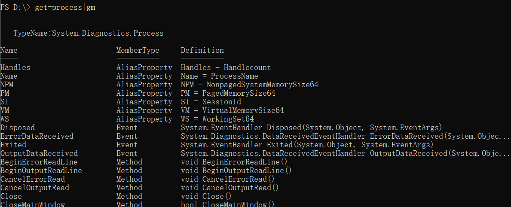

### 2.调用对象的方法,很多进程都有有一个kill()方法,如我们可以先打开一个notepad进程,然后使用下面的命令来终止这个进程

```powershell
(get-process -name notepad).kill()
```

可以这么来看notepad进程对象的属性和方法,前提是必须有一个notepad正在运行

```powershell
get-process -name notepad | gm
```

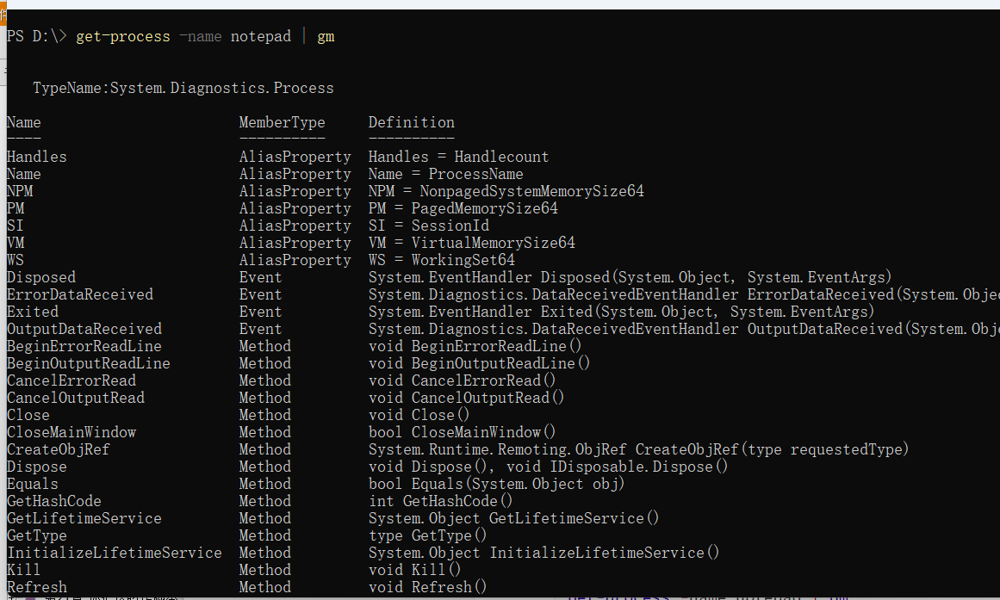

可以看到,它是有一个Kill()方法的.

### 3对象排序

#### get-process命令返回的是一个集合,我们就可以对这个集合进行排序

```powershell
get-process | sort-object -property cpu 或者简写 get-process | sort cpu
```

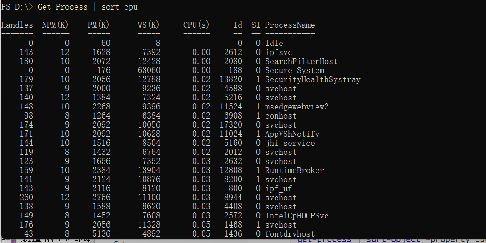

#### 还可以降序排列,好处是可以看到哪些进程使用最多cpu资源

```powershell
Get-Process | sort cpu -desc
```

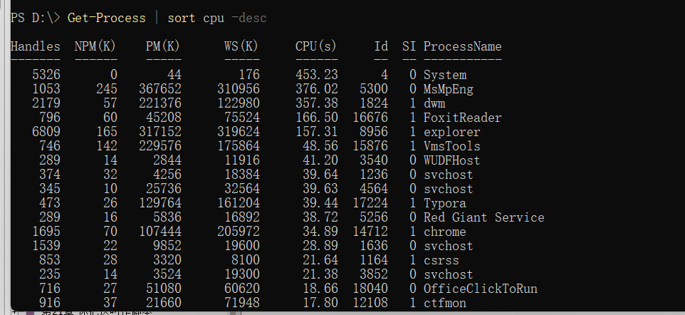

#### 还可以按多个列来排序

```powershell
Get-Process | sort cpu,id -desc
```


#### 还可以选择自己需要的属性,配合select-object

```powershell
 Get-Process | sort cpu,id -desc | select-object -property id,cpu,processname
```

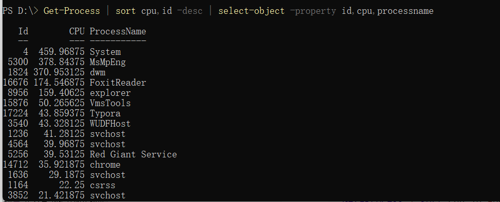

#### 练习(第八章)

##### 1.生成随机数的cmdlet

```powershell
get-random -minimum 1 -maximum 100
```

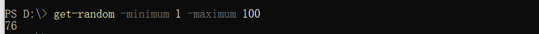

#####  2.显示当前日期时间的cmdlet

```powershell
get-date
```

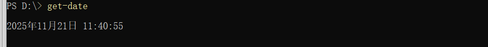

##### 3.get-data获取到的对象是SysTem.DataTime对象

##### 4.给get-date函数添加过滤使他显示dayofweek

```powershell
 get-date | select dayofweek
```


##### 5.显示window的hotfix

```powershell
get-hotfix
```

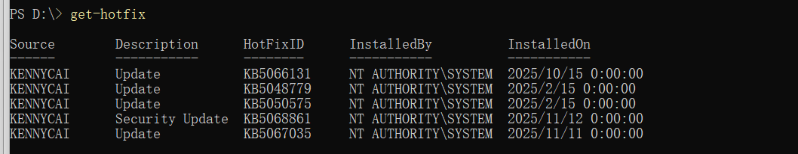

##### 6.对hotfix按照安装日期进行排序标签只显示安装日期,id和安装用户

```powershell
get-hotfix | sort installedon | select hotfixid,installedBy,installedon
```

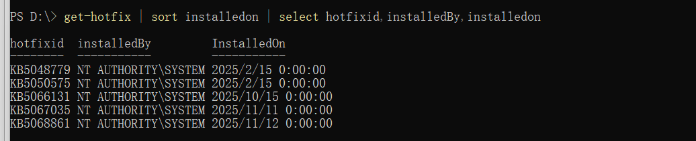

##### 7.对hotfix按照描述排序,标签只显示描述,id和安装日期

```powershell
get-hotfix | sort description | select description,hotfixid,installedon
```

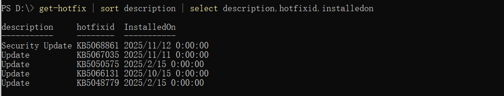

##### 8.从系统安全日志中选择50条,按时间和索引升序排列,显示索引时间来源,并且输出到一个txt文件

```powershell
get-eventlog -logname security -newest 50 | sort timegenerated ,index | select index,timegenerated,source | out-file event.txt
```

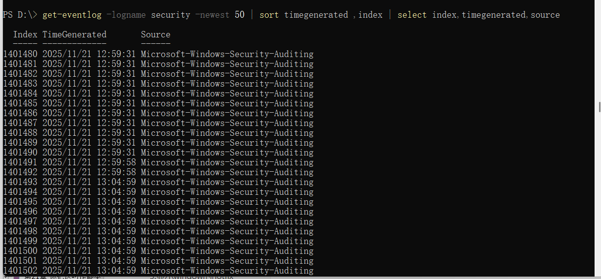
